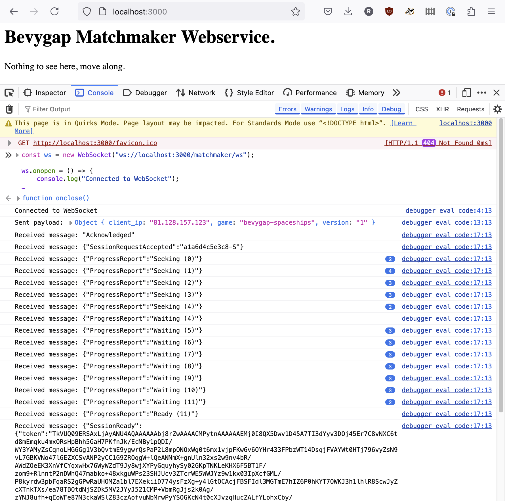

# Matchmaker Services

To review, so far we have a public NATS server, and Edgegap is ready to deploy instances of our gameserver.

The next step is to configure the matchmaker services.

The game will talk to the matchmaker webservice to say "i want to play". The matchmaker will then make requests to the Edgegap API to find or start a server to play on, create a Lightyear Connect Token, and reply to the game client with something that looks like this:

**Example successful response from matchmaker:**
```json
{
    token: "TkVUQ09ERSAxLjAyANU4AQAAAAAAxV...snip...",
    ip: "172.104.236.32",
    port: 30004,
    cert_digest: "e3:76:4d:86:6c:11:d1:96...snip..."
} 
```

The `ip` and `port` are the public IP and external port of the gameserver deployment on Edgegap.
The `token` is a Lightyear Connect Token that the client has to pass to the gameserver when connecting. Behind the scenes this is linked to an Edgegap session ID.
The `cert_digest` allows browsers to verify the WebTransport server's self-signed certificate. This is automatically generated by gameservers when they start up.

Once the game client has this response, it triggers Lightyear to make the connection to the gameserver.

## To docker or not to docker?

I'll show how to start the services without docker, because it's easier to test and develop them this way. Know that there are github actions that will build and containerize all this, so you can run them alongside the NATS server with docker-compose. (explanation of this to follow in a later section.)

## Running the Matchmaker Service

Make sure your shell has the NATS and Edgegap environment variables set:

```bash
set -a && . ./nats.env && set +a
set -a && . ./edgegap.env && set +a
```

Run the matchmaker. This is the service that talks to Edgegap, and also generates Lightyear Connect Tokens.
It needs to know the lightyear server private key and protocol id to make the tokens.

At the moment, the lightyear private key and protocol id are compiled into the gameserver.
Search the `bevygap-spaceships` code for `PRIVATE_KEY` and `PROTOCOL_ID` to find them, hopefully these are still the correct values:

```bash
cargo run -p bevygap_matchmaker -- \
  --app-name bevygap-spaceships \
  --app-version 1 \
  --lightyear-protocol-id 80085 \
  --lightyear-private-key '1, 2, 3, 4, 5, 6, 7, 8, 9, 0, 0, 0, 0, 0, 0, 0, 0, 0, 0, 0, 0, 0, 0, 0, 0, 0, 0, 0, 0, 0, 0, 1'
```

## Running the Matchmaker Webservice

The matchmaker is listening to a NATS topic, ready to create sessions. The webservice exposes this via HTTP (websockets) to game clients.

In another shell, set your NATS environment variables:

```bash
set -a && . ./nats.env && set +a
```

And run:

```bash
cargo run -p bevygap_matchmaker_httpd -- --cors http://127.0.0.1
```

One of the log lines should show you that the matchmaker webservice listens on port 3000:
```
INFO bevygap_matchmaker_httpd: bevygap_matchmaker_httpd listening on 0.0.0.0:3000  
```

## Testing the Matchmaker Webservice

Let's test the matchmaker webservice without a game client. Open up your browser to <a href="http://localhost:3000" target="_new">http://localhost:3000</a> so the page has the correct security context.
Find the developer tools console, and paste in this javascript to simulate a real client asking for a match over a websocket connection:

```javascript
const ws = new WebSocket("ws://localhost:3000/matchmaker/ws");

ws.onopen = () => {
    console.log("Connected to WebSocket");

    const payload = {
        client_ip: "81.128.157.123",
        game: "bevygap-spaceships",
        version: "1"
    };
    
    ws.send(JSON.stringify(payload));
    console.log("Sent payload:", payload);
};

ws.onmessage = (event) => {
    console.log("Received message:", event.data);
};

ws.onclose = () => {
    console.log("WebSocket connection closed");
};
```



If that worked, you will notice a new deployment is running in the Edgegap dashboard, and a new Edgegap session is active.

After a minute or so, the matchmaker will realise that no game client ever consumed that connect token, and delete the Edgegap session.

After 10 minutes of no sessions linked to the deployment, Edgegap will stop the deployment.

Feel free to manually terminate it now.

## Shall we play a game?

The matchmaking webservices are ready – time to connect with a game client!

