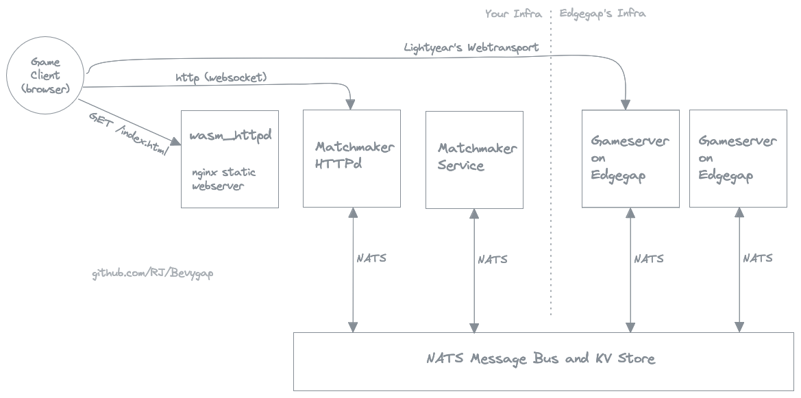

# Introduction

Bevygap is a suite of tools to help you get your (bevy+lightyear) game running on Edgegap, so that servers are spun up and down in response to player demand, in appropriate locations. When players click "connect", the system either picks an existing server nearby, or spins up a new one, which takes just a few seconds.

### Scaling and costs

It **scales down to zero** pretty well - Edgegap can be configured to terminate server instances with no players in the last 10 minutes, and you are only billed for server uptime. There's a small static cost to running your NATS server and matchmaking service. I'm running mine on the same linux server that hosts my personal website.

In theory, it **will scale up** pretty well too. Edgegap will keep launching new servers for you and directing new players to them. Nice problem to have, and not one i've encountered yet :)

### Bevygap components

* A bevy plugin for your gameserver, `bevygap_server_plugin`
* A bevy plugin for your game clients, `bevygap_client_plugin`
* A matchmaker service that talks to the Edgegap API, `bevygap_matchmaker`
* A webserver frontend for your matchmaker service, that `bevygap_client_plugin` talks to: `bevygap_httpd` 
* A shared crate, `bevygap_shared`, used to connect to the NATS message bus.
* An example game, `bevygap-spaceships`, which is deployable to Edgegap using all of the above.

## Dev, test, deploy cycle

Day-to-day I still do everything locally (without docker or edgegap).
Need to document how to configure bevygap to bypass and connect without a token. TODO.

When it's time to deploy, just push a git tag, and the github action will containerize your server and push it to Edgegap's container registry.

TODO flesh this out.
